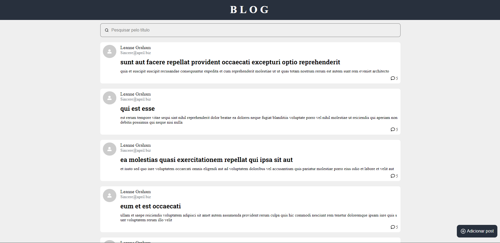
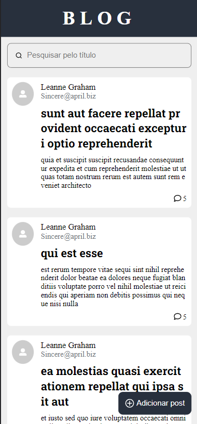

<h1 align="center">Alkabot Blog</h1>

## 🔖Preview
<p align="center" >

	  
	</p>
  
## 📜 Sobre
<p>
Simulação de um blog com seus posts e comentários de cada post.
</p>
<p>
	Ao clicar em um post é possível visualizar seus comentários.
</p>

## 🚀 Tecnologias
### Frontend:
- React
- Typescript
- Styled Components
- React Icons
- Axios
- React Router
- ViteJs


## 💻 Iniciando o Projeto


### Requisitos

**Clone o Projeto e acesse o Diretório**
<font size="3">(OBS: Necessário ter o git instalado)<font />

```bash
$ git clone https://github.com/andreydantasvf/blog-alkabot && cd blog-alkabot
```

**Para iniciar a aplicação:**
<font size="3">(OBS: Necessário ter o nodejs instalado)<font />
```bash
$ npm install
```
```bash
$ npm run dev
```

---
Feito por Andrey Dantas 👋 Siga minhas redes sociais:
- [Instagram](https://www.instagram.com/andreydantasvf/)
- [Twitter](https://twitter.com/andreydantasvf)
- [Linkedin](https://www.linkedin.com/in/andreydantasvf/)